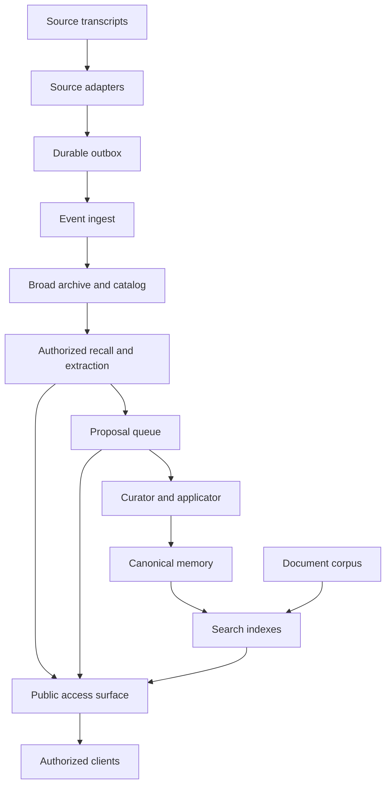
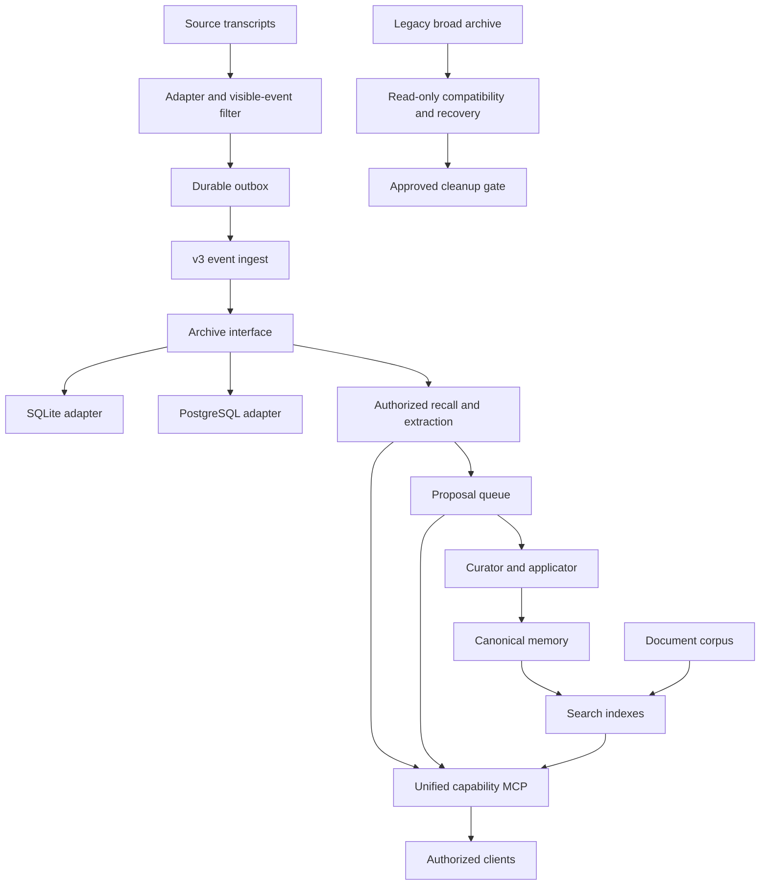

# Agent Memory Fabric

Shared REST/MCP boundary for scoped memory access.

## Architecture

### Current baseline



Native and RAW transcripts are authoritative at their sources. The broad central
archive is a compatibility and recovery layer; it is not the authoritative copy
of a native transcript.

### Future target



The future v3 archive contains only minimal visible conversation events, never
full RAW. The legacy broad central archive remains read-only for compatibility
and recovery until migration gates pass and cleanup is separately approved.
A deployment selects either SQLite or PostgreSQL behind the archive interface;
the diagram does not imply dual writes. The legacy branch receives no new v3
events.

## Curated specification index

- [Roadmap and lifecycle](docs/agent-memory-fabric-roadmap.md)
- [Conversation event v3 source rules](docs/conversation-event-v3-source-rules.md)
- [Conversation archive interface](docs/conversation-archive-interface-v1.md)
- [Content protection policy](docs/content-protection-policy-v1.md)
- [Capability MCP v1](docs/capability-mcp-v1.md)
- [v2 compatibility view](docs/conversation-session-v2-compatibility.md)
- [v3 migration safety](docs/v3-migration-safety-v1.md)
- [Recovery pair](docs/m4-recovery-pair-v1.md)
- [Cleanup inventory](docs/m4-cleanup-inventory-v1.md)
- [Deployment procedure](docs/deployment-procedure.md)

## Current shape

- stable REST/MCP boundary with actor, scope and permission enforcement
- backend-neutral scoped-search adapter
- idempotent proposal queue; public requests never write directly to canonical memory
- encrypted, content-addressed RAW proposal storage and auditable catalog
- encrypted transcript-event ingestion with a persistent outbox and session reader
- local authorization registry
- legacy REST v1, MCP SSE and MCP Streamable HTTP compatibility
- canonical PAM read/search through an internal stdio adapter; proposal queue
  status remains a separate surface
- request-bound conversation context tokens and monotonic curator/apply receipts
- purpose-specific authorization and exact HMAC context intersection across PAM records and v2 sessions
- one Fabric transaction for receipt state, proposal lifecycle and durable audit
- authoritative REST/MCP/v1 schemas and fixtures under `config/contracts/` and `scripts/fixtures/contracts/`

## Architecture and integrations

- [Optional integration framework](docs/integration-framework.md): versioned
  catalog plus plan-gated install, adoption, health and removal lifecycle.
- [Obsidian Second Brain integration](docs/obsidian-second-brain.md): implemented, opt-in
  standalone, shadow, and active client architecture with swappable data,
  memory, model, and retrieval backends.

## Auth registry

Set `AMF_AUTH_REGISTRY_PATH` to a local JSON registry. The legacy
`MEM0_AUTH_REGISTRY_PATH` name remains supported. Relative paths resolve from the
repo root; deployments should use an absolute mounted secret path.

```bash
AMF_AUTH_REGISTRY_PATH=/run/secrets/agent-memory-fabric-auth.json
MEM0_AUTH_CACHE_TTL_MS=15000
```

```json
{
  "rows": [
    {
      "tokenSha256": "5232b8b43646788aa6ee169eadc914fc21bcdfa56c52e914413569e1f7affe81",
      "active": true,
      "actor": "actor_example",
      "mode": "allow_all",
      "allowedScopes": "*",
      "allowedVaults": ["vault_example"],
      "permissions": "memory:search,memory:read,memory:propose,memory:add,memory:status,sessions:read,raw:decrypt,raw:ingest,documents:search,documents:read,documents:write,purpose:operator_review"
    }
  ]
}
```

`tokenSha256` is the lowercase SHA-256 digest of the bearer token; bearer values are
checked with a constant-time comparison and need not be stored in the registry.
`allowedScopes` and `permissions` accept arrays or comma-separated strings. `allowedVaults`
is an optional array used by the document corpus; scoped actors fail closed when it is absent. The
fabric also accepts a bare row array and a compatible `{ "data": [...] }` shape.

## Storage

`AMF_RAW_ENCRYPTION_KEY` is required before proposal endpoints accept data. It
must be exactly 32 bytes encoded as canonical padded base64, or exactly 64
hexadecimal characters. Without it,
health and search compatibility remain available but proposals return `503`.

The catalog abstraction supports SQLite for local use and an explicit PostgreSQL
production adapter. PostgreSQL never activates implicitly: set
`AMF_CATALOG_KIND=postgres` and provide its dedicated connection and SSL settings.
See [PostgreSQL catalog operations](docs/postgres-catalog.md). HKDF derives
independent encryption, content-address and catalog-tag keys.
RAW proposal bodies use AES-256-GCM with authenticated version, content id and key id.
A keyed HMAC-SHA256 content address allows deduplication without exposing a guessable
plaintext digest. The key ring reads old key ids while new writes use the configured
current key. Catalog actor, scope, source and idempotency values are opaque keyed tags.
Use `AMF_RAW_KEY_RING_PATH` for a mounted production secret. Idempotency retries
compare the authorized existing canonical payload, so active-key rotation does not
turn a valid retry into a conflict.

Catalog health and audit persistence are bounded. Audit is fail-closed: an audit
outage returns `503` rather than allowing an unaudited success. PostgreSQL pool
acquisition, queries and statements use validated finite timeouts documented in
[PostgreSQL catalog operations](docs/postgres-catalog.md). Importing the server
module while `AMF_SERVER_ENABLED` is false does not construct storage or parse
storage secrets.
Proposal failures never locally delete content-addressed RAW, even after a proven
rollback: another concurrent proposal may already reference the same blob. Orphan
collection requires a separately approved, catalog-coordinated reference proof.
RAW v2 sessions bind only stable routing invariants (`conversation`, optional
`room`, optional `thread`), plus runtime and conversation kind. Actor, sender,
person, relationship and source identity remain event-scoped, so user, system and
assistant observations can share one conversation. A room/thread/conversation
change is rejected before ciphertext commit. Failures or binding races after
commit retain the encrypted object for reconciliation; physical deletion still
requires the same catalog reference proof.

Transcript clients encrypt each event before it reaches the HTTP boundary. Configure
the server with `AMF_INGEST_KEY_RING_PATH`; the mounted JSON maps every key id to its
allowed actor and source instances and includes an independent, rotation-stable
`digestKey`. The authenticated stable digest provides logical idempotency: the same
event encrypted again, including after an encryption-key rotation, is a duplicate;
changed plaintext under the same event id is a conflict. Actor, source instance,
event, session, projection and key id are bound into AES-GCM AAD. The catalog event,
session update and audit row commit in one transaction.

Provision collector actors and per-client handoffs with the fail-closed operator
CLI. It stores only bearer digests server-side and fixes collector access to
`memory:status` plus `raw:ingest`. Recall credentials and context-signing
handoffs are provisioned separately and cannot read or create collector key
material.

## API v2

Success uses `{ "ok": true, "data": ..., "meta": ... }`; errors use
`{ "ok": false, "error": { "code", "message", "details" }, "meta": ... }`.

- `POST /v2/memory/search`
- `POST /v2/context/search` (interleaved canonical-memory and editorial-document recall)
- `POST /v2/memory/proposals` (requires `Idempotency-Key`)
- `POST /v2/ingest/raw-events` (requires `raw:ingest`)
- `GET /v2/internal/extractor/sessions?limit=1&cursor=...` and
  `GET /v2/internal/extractor/sessions/:id/transcript` (service-only,
  `raw:extract`; redacted text only)
- `GET /v2/memory/:id` (canonical record, rationale and expected revision)
- `GET /v2/memory/proposals/:id` (status only; no record decryption)
- `GET /v2/internal/curation/proposals?status=queued&limit=50&cursor=...`
  (bounded metadata only; requires `memory:curate`)
- `GET /v2/internal/curation/proposals/:id` (one proposal and canonical digest;
  requires `memory:curate` and an audited decrypt intent)
- `POST /v2/internal/curation/receipts` (scope-bound decision/apply receipt)
- `POST /v2/internal/curation/reconcile` with `{limit?,cursor?}` (actor-scoped,
  bounded receipt reconciliation; requires `memory:apply-receipt`; `allow_all`
  remains an explicit administrative policy mode)
- `POST /v2/sessions/search` (requires `purpose`)
- `GET /v2/sessions/:id?purpose=...`
- `GET /v2/sessions/:id/transcript?purpose=...&view=redacted|original`
- `GET /v2/status`

The proposal body is exactly `{record,rationale,expectedRevision?}`. `record`
must conform to PAM 0.6 `amf-memory/v1`: canonical scope IDs, exact fields and
strict timestamps/provenance/lifecycle. `confidence` is required and exactly
`{score,basis,assessedAt}` with a finite `[0,1]` score, approved basis and UTC
timestamp. Restricted/confidential and
person/relationship records must carry a sealed AES-256-GCM envelope with
canonical base64, 12-byte IV, 16-byte tag, opaque `kekId`/`keyRef`, and the PAM
canonical AAD digest. A successful REST or MCP acknowledgement exposes
`{status,proposalId,duplicate,idempotencyKey}`; the last field is the exact
authoritative retry key accepted or derived by the Fabric.

Curation cursors bind actor, requested statuses, and the current scope ACL, so
they cannot cross filters or credentials. Exact payload reads support
`queued`, `review`, and `promoted` recovery, while rejected/revoked proposals
return not-found before RAW decryption.

The canonical index hot-reloads from `<record-index-path>`. PAM writes non-secret
`contextRefs`; Fabric derives opaque HMAC tags with its dedicated routing key.
Index and routing-key files must be owner-owned regular mode-`0600` files.

Every memory/session transport, including MCP, errors and status, is private and
`no-store`. Session calls require one opaque purpose code: `conversation_recall`,
`continuity_resume`, `incident_debug`, `operator_review`, or `memory_curation`.
MCP sessions have TTL, global/per-actor caps, and revalidate token activity and
policy on every call. Original transcripts additionally require `raw:decrypt`;
redacted is the default and returns only bounded, normalized `user`/`assistant`
text from authenticated v2 observations. System, tool, structured and path/media
payloads are omitted. A non-empty `sessions_search.query` searches that redacted
text only after exact signed-context filtering. Redacted `session_transcript`
also accepts `query`; the query, context and cursor are request-bound, while
`original` plus `query` is rejected. Text search scans at most the newest 256
events per candidate session and 16 MiB of ciphertext. Candidate sessions are
context/time-filtered before each bounded 64-session page; a server-MACed keyset
cursor continues without a `>64` outage. Only the preferred, non-conflicted,
non-tombstoned logical observation is eligible. Older history can be selected
with a signed time window. Signed `canonicalScopes` are checked against the
server registry before session access. REST GET clients send the signed context
only in `X-AMF-Context-Token`; dedicated actors cannot place it in
the query string. The session reader is configured automatically when the
ingest key ring and catalog are available; otherwise MCP advertises
`sessionReader: false` and the routes return `session_reader_unconfigured` (`503`).

MCP advertises `memory_search`, `memory_read`, `memory_propose`, `context_search`,
`memory_proposal_status`, `sessions_search`,
`session_get`, `session_transcript`, and `memory_status`, plus legacy
`list_scopes` and `gateway_health` tools.

`POST /v1/memory/add` remains available with HTTP `200`, deprecation/sunset
headers and a deterministic derived idempotency key when an old client sends none. It reports the accepted
proposal as `queued`/non-canonical, and never calls `Mem0.add()` directly. Search
v1 and both MCP transports remain compatible.

## Run locally

```bash
npm install
cp .env.example .env.local
# Point AMF_POLICY_PATH at a reviewed policy, inject secrets, and explicitly enable:
export AMF_SERVER_ENABLED=true
bash scripts/run.sh
```

Use only synthetic policies, credentials, and data for local fixtures. Do not
commit secrets or runtime `.env` files. Session recall also requires a reviewed,
signed route manifest; use the dry-run-first procedure in
`docs/recall-consumer-provisioning.md`.

## Transcript ingestion CLI

`scripts/amf-transcript-ingest.mjs` supports allowlisted transcript sources,
durable encrypted outbox delivery, replay, deduplicated backfill, and polling.
A real run requires an explicit HTTPS endpoint, bearer token, actor, source
instance, key identifier, encryption key, and independent digest key. Key rings
retain old decrypt keys during rotation; the checkpoint key is independent and
stable so existing rolling checkpoints do not change when encryption keys rotate.
The local test sink is test-only.

Polling verifies bounded rolling checkpoints; `--full-audit` requests an
explicit whole-history audit. Backfill uses a bounded lease and only takes over a
stale lease after its owner is confirmed unavailable. Delivery failures remain
queued and do not block the source runtime. The HTTP timeout covers request,
headers, and the complete streamed response body; responses are size-capped
before JSON parsing.

Live polling fails closed when its encrypted cursor is absent. Initialize a new
poller once with `--cursor-namespace realtime --bootstrap-tail`; later polls use
the same namespace without bootstrap. Historical ingestion uses
`--backfill --cursor-namespace backfill`, so it cannot overwrite realtime
cursors. Native JSONL rows are bounded at 4 MiB including the line ending. The
encrypted RAW request contract is 8 MiB for both client and server; other routes
retain their smaller body limit.

## Deployment block

The backend is disabled by default and activates only after reviewed
configuration. Read-side operations may recreate and retry their shared client;
proposal writes never retry a failed write. Do not enable a backend against an
existing collection until its data migration is explicitly reviewed.

The deployment overlay builds from the pinned source, requires reviewed policy,
authorization, and key material, and does not use an example policy as a runtime
fallback. Run the documented preflight before any rollout. This README does not
authorize deployment; follow [the release deployment procedure](docs/deployment-procedure.md).
