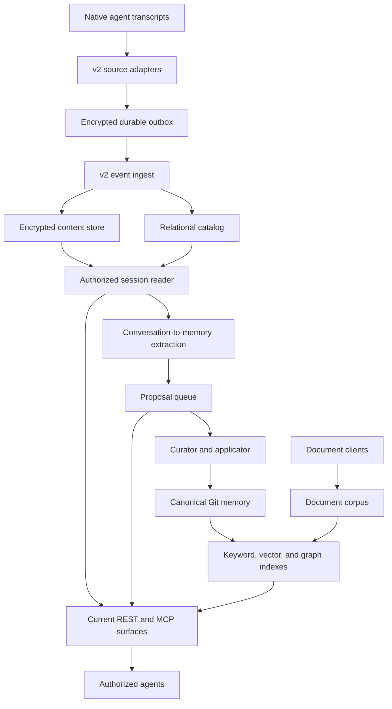
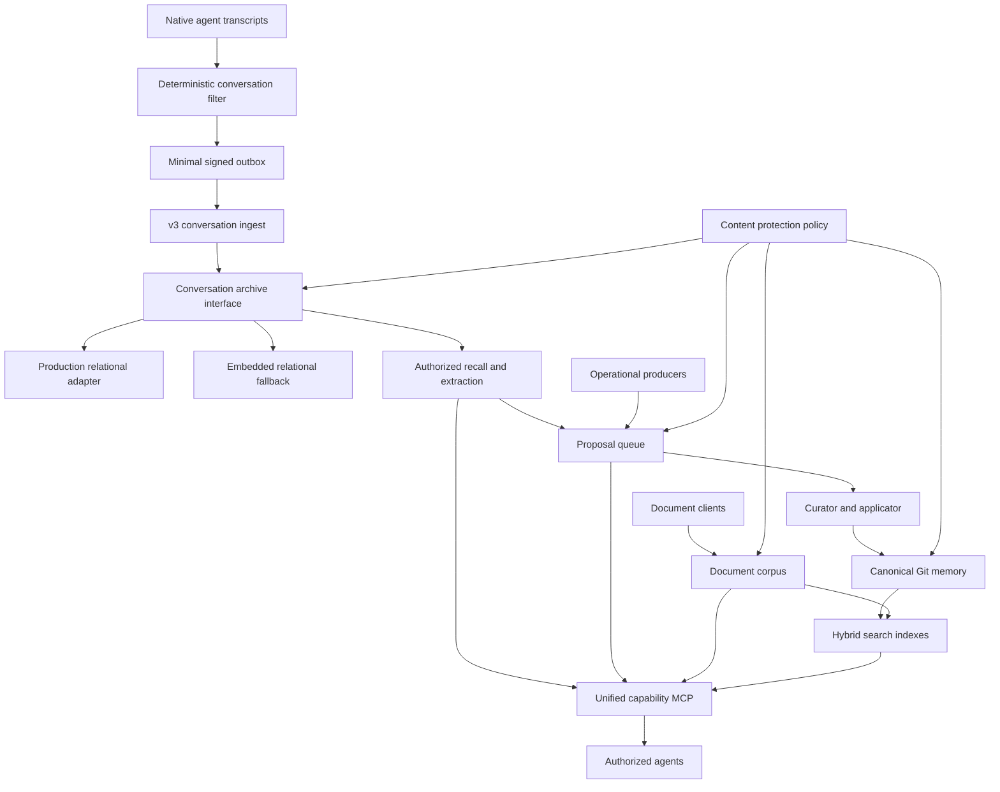

# Agent Memory Fabric Roadmap and Implementation Plan

Status: active; M3 accepted, M4 next
Audience: maintainers, contributors, and operators
Maintenance rule: update this checklist in the same change that completes a roadmap item.

## Purpose

This roadmap evolves Agent Memory Fabric (AMF) from a central archive of broad
session events into a smaller, backend-neutral fabric for conversations,
documents, and curated memory.

The target does **not** remove conversation history. Native transcripts remain
at their source, while the central fabric keeps a deterministic conversation
archive containing only the user-visible exchange needed for recall,
continuity, and memory extraction. System prompts, developer instructions,
tool payloads, reasoning, telemetry, local paths, and binary attachments do not
enter that archive.

The work also consolidates agent access behind one capability-oriented Model
Context Protocol (MCP) server, introduces plaintext-capable storage policies,
and replaces risky deploy-time data copies with explicit migration and recovery
procedures.

## Public-safety rules

- Keep all code, comments, diagrams, schemas, and documentation in English.
- Do not include private people, hosts, addresses, filesystem paths, repository
  coordinates, pull request numbers, credentials, or deployment topology.
- Use examples with synthetic actors, scopes, identifiers, and endpoints.
- Keep operational presets and environment-specific runbooks outside public
  artifacts.
- Use GitHub-compatible Mermaid with top-to-bottom flow and short labels.

## Glossary

| Term | Meaning |
|---|---|
| AMF | Agent Memory Fabric, the policy and capability boundary. |
| MCP | Model Context Protocol, the agent-facing tool transport. |
| Conversation event | A normalized user or assistant message stored for recall. |
| Canonical memory | A reviewed, durable memory record stored in version control. |
| Document corpus | Editorial or reference documents managed independently from conversations. |
| Legacy v2 archive | The existing broad central session-event representation. |
| v3 archive | The planned minimal central conversation-event representation. |

## Locked decisions

1. Native transcripts remain authoritative at their source.
2. The central v3 archive stores conversations, not full raw session streams.
3. Only normalized, user-visible `user` and `assistant` text is eligible for the
   conversation archive.
4. Attachments are represented by references, visible captions, safe media
   metadata, and optional digests. Binary content remains outside the archive.
5. PostgreSQL is the production relational adapter and SQLite is the embedded
   fallback. Both implement the same storage interface and conformance suite.
   JSON Lines is not a storage backend.
6. Storage is plaintext by default. A content policy may selectively enable
   AES-256-GCM for a source instance and content class.
7. Compression, when justified by measurement, happens before optional
   encryption. Ciphertext is never presented as compressible input.
8. Deploys never copy live data directories. Code is rebuilt from version
   control; small configuration and secret material follow their own recovery
   procedure; data recovery relies on the infrastructure recovery layer.
9. Destructive legacy cleanup happens only after deterministic backfill,
   reconciliation, cutover, and one verified recovery copy.
10. Agents use one provider-neutral capability MCP. Backend and product names do
    not appear in tool schemas or results.
11. Each advertised capability has exactly one authoritative provider selected
    by configuration. Missing or ambiguous providers fail startup; there is no
    hidden merge, fallback, or failover.

## Current baseline

The current system centrally ingests a broad encrypted event projection. It
already separates conversation recall, document knowledge, proposals, curated
memory, and search, but these capabilities are exposed through multiple
surfaces and the archive carries more data than conversation continuity needs.

## Target milestone

The v3 design reduces the central archive before storage, preserves the memory
and document layers, and presents all enabled capabilities through one
provider-neutral MCP boundary.

The two relational adapters are alternatives behind one interface; a
deployment selects one. The diagram does not imply dual writes.

## Contracts to implement

### Conversation event v3

Define a strict, versioned `amf.conversation-event/v3` schema with:

- stable event, conversation, source-instance, and optional thread identifiers;
- normalized `user` or `assistant` role and visible text;
- source and occurrence timestamps, deterministic ordering, and direction;
- conversation kind and opaque authorization context tags;
- edit, replacement, tombstone, and conflict semantics;
- attachment references with safe metadata, captions, and optional digests;
- a stable logical digest for deduplication and conflict detection;
- an authenticated integrity envelope suitable for HTTPS delivery.

Explicitly reject system, developer, tool, reasoning, usage, telemetry, native
raw rows, executable payloads, binary bodies, local paths, and secret-bearing
metadata.

### Content protection policy

Introduce a public policy contract with `plaintext` and `aes-256-gcm` codecs.
Rules select a codec by source instance and content class:

- `conversation`;
- `proposal`;
- `canonical-memory`;
- `document`.

The default policy is plaintext for every class. Encryption keys are required
only when an active rule enables encryption. Existing encrypted objects remain
readable during migration. The next canonical-memory schema supports both plain
and sealed claims without coupling the codec to visibility. The previous schema
remains readable.

### Conversation archive interface

Define one adapter contract for transaction, identity, ordering, deduplication,
conflict detection, tombstones, pagination, retention, and audit. PostgreSQL and
SQLite must pass the same fixtures. The application must not expose the selected
adapter through its agent-facing API.

### Unified capability MCP

Expose every enabled and authorized agent capability through one MCP server.
The initial public tool set is:

- `search` with typed `kinds`;
- `read`;
- `propose`;
- `proposal_status`;
- `status`.

`search` defaults to canonical memory and documents. Conversation search is
enabled only when `conversation` is explicitly requested and the caller has the
required purpose and scope. Search implementations may differ internally, but
equivalent queries must return substantially comparable ranked results and the
same authorization boundary.

Administrative and destructive operations remain outside the fleet-wide agent
surface. During migration, old tool names may be accepted as unadvertised
aliases; new clients receive only the provider-neutral names.

## Milestones and implementation checklist

Check an item only after its acceptance evidence exists. A milestone is complete
only when every item in it is checked.

### M0 — Stabilize the existing service

- [x] Merge and release a deploy procedure that never copies a live data directory.
- [x] Back up only the small configuration material explicitly covered by the recovery procedure.
- [x] Verify incremental semantic indexing and its scheduled execution after a clean recreation.
- [x] Verify that core health covers only declared core collectors and services.
- [x] Keep profile-specific consumer canaries separate from core service health.
- [x] Release the existing bounded local-context fallback for ordinary authorized direct messages.
- [x] Add a deploy regression proving that low free space cannot trigger a partial data copy-back.

Acceptance: a clean build and recreation preserve the mounted data store, semantic
indexing runs on schedule, and a failed deploy cannot truncate application data.

### M1 — Freeze v3 contracts and safety gates

- [x] Publish the conversation-event v3 schema and invalid-payload fixtures.
- [x] Publish deterministic inclusion and exclusion rules for every supported source.
- [x] Publish attachment-reference and tombstone semantics.
- [x] Publish the content protection policy and canonical-memory schema revision.
- [x] Publish the archive adapter interface and shared conformance fixtures.
- [x] Publish the provider-neutral MCP schema and authorization matrix.
- [x] Define idempotency conflict visibility, operator notification, and resolution.
- [x] Define pause, rollback, reconciliation, and exact cleanup manifests.
- [x] Threat-model plaintext storage, integrity, authorization, audit, and optional encryption.

Acceptance: contracts are versioned, examples contain no private context, and
security review has no unresolved blocking finding.

### M2 — Pause legacy growth without losing recovery state

- [x] Stop all legacy v2 collectors before archive implementation begins.
- [x] Preserve collector cursors, outboxes, acknowledgements, and dead letters unchanged.
- [x] Record signed pause manifests and last-known checkpoints.
- [x] Report health as a migration pause or degraded state, never as healthy.
- [x] Verify that native source transcripts retain the paused interval.

Acceptance: no new v2 rows are created, all replay state is recoverable, and no
source transcript is altered or deleted.

### M3 — Implement the minimal conversation archive

- [x] Implement deterministic filters for each supported transcript format.
- [x] Implement owner-only plaintext outboxes with authenticated delivery.
- [x] Add `POST /v3/ingest/conversation-events` with bounded inputs.
- [x] Implement PostgreSQL and SQLite archive adapters.
- [x] Run the complete adapter conformance suite against both implementations.
- [x] Implement stable deduplication and changed-payload conflict detection.
- [x] Implement edits, replacements, tombstones, and deterministic ordering.
- [x] Add real-socket client-abort, end-to-end HTTP conflict, and PostgreSQL endpoint composition coverage.
- [x] Normalize PostgreSQL startup and connection failures into typed archive outcomes.
- [x] Bound SQLite replacement and tombstone visibility work for long edit chains.
- [x] Align duplicate replay audit semantics across append and retention operations.
- [x] Retry PostgreSQL schema initialization after a transient first-touch failure.
- [x] Preserve the v2 session-read API as a compatibility view over v3 data.
- [x] Add audit-outage injection tests and prove audited operations fail closed.
- [x] Add key-rotation drills for every policy class that enables encryption.
- [x] Measure representative storage, filesystem-block, and query costs.
- [x] Enable compression before encryption only where the measurement justifies it.

Acceptance: the same fixtures produce equivalent observable behavior on both
adapters, excluded content never crosses the filter, and recovery tests pass.

### M4 — Backfill, reconcile, and cut over

- [ ] Backfill normalized user and assistant content from the v2 archive without reading native raw rows into v3.
- [ ] Backfill the paused interval from native sources using the same deterministic filters.
- [ ] Replay preserved outboxes and dead letters through the native adapter path.
- [ ] Reconcile event counts, stable identifiers, digests, time ranges, edits, and tombstones.
- [ ] Prove that duplicates are acknowledged and changed payloads become visible conflicts.
- [ ] Take and restore-test one recovery copy of the old archive and one of the new archive.
- [ ] Switch session reads and extraction to the v3 archive.
- [ ] Observe a bounded canary period with queue, latency, and error thresholds.
- [ ] Close plaintext migration reads for encrypted selectors only after reconciliation succeeds.
- [ ] Remove only legacy transcript rows and blobs proven unreferenced by the catalog.
- [ ] Preserve proposal, canonical-memory, and document data that shares storage.

Acceptance: v3 covers the expected conversation history and paused interval,
the compatibility API reads v3, rollback is proven, and cleanup targets are
exactly enumerated before deletion.

### M5 — Restore conversation-to-memory extraction

- [ ] Rename and adapt the existing extractor to consume conversation events.
- [ ] Keep extraction proposal-only; it must not write canonical memory directly.
- [ ] Run a dry-run quality evaluation with bounded, content-safe reporting.
- [ ] Define promotion, rejection, duplicate, and no-op quality thresholds.
- [ ] Enable scheduling only after the quality gate passes.
- [ ] Prove one conversation can produce at most one equivalent proposal per revision.

Acceptance: the extractor is resumable, idempotent, bounded, and produces no
canonical writes outside the curator/applicator path.

### M6 — Deliver the unified capability MCP

- [ ] Implement one provider registry with one authoritative provider per capability.
- [ ] Fail startup for missing or ambiguous enabled providers.
- [ ] Implement typed `search` with memory and document defaults.
- [ ] Require explicit kind, purpose, and authorization for conversation search.
- [ ] Implement provider-neutral `read`, `propose`, `proposal_status`, and `status`.
- [ ] Keep administrative tools on a separate operator-only surface.
- [ ] Add unadvertised compatibility aliases for migrated clients.
- [ ] Run every public MCP contract fixture against each supported transport.
- [ ] Add authorization tests proving no tool widens scope through another provider.
- [ ] Compare equivalent search queries across implementations with declared tolerances.

Acceptance: agents need one MCP configuration, enabled tools are complete and
provider-neutral, and contract fixtures cover every advertised tool and error shape.

### M7 — Update public documentation and operate the release

- [ ] Replace the README architecture section with the target vertical diagram.
- [ ] Keep the current and target diagrams in this roadmap until cutover completes.
- [ ] Explain clearly that native transcripts remain and only broad central duplication is retired.
- [ ] Document v3 schemas, storage selection, content policy, MCP tools, and compatibility behavior.
- [ ] Add public-safe local examples for PostgreSQL and SQLite.
- [ ] Add migration, rollback, recovery, and cleanup procedures without environment-specific values.
- [ ] Add a release checklist and update this roadmap after each accepted milestone.
- [ ] Scan all changed documentation for private identifiers before publication.

Acceptance: a new contributor can understand the complete system from the
README, render every Mermaid diagram on GitHub, run local fixtures, and identify
the next unchecked milestone without private operational knowledge.

## Subagent team and token budget

Only the lead and one worker may be active at the same time. Do not start the
entire team for every milestone.

| Role | Selected model | Use | Budget rule |
|---|---|---|---|
| Lead and integrator | Codex `gpt-5.6-sol`, high reasoning | Architecture decisions, task briefs, integration, final validation | One persistent lead; never duplicate worker scans. |
| Implementation worker | Codex `gpt-5.6-terra`, low or medium reasoning | One bounded contract, adapter, migration, or test slice | Fresh narrow context; stop after acceptance evidence. |
| Documentation reviewer | Codex `gpt-5.6-terra`, low reasoning | English, privacy, checklist, and Mermaid review | Reuse the implementation worker slot for one read-only pass. |
| Security reviewer | Claude Fable | Threat model and cutover review | Optional single pass at M1 and M4 only. |

To reduce coordination cost and duplicated work:

- run at most one worker beside the lead;
- give workers file and acceptance-criterion scopes, not full conversation history;
- use low reasoning for mechanical edits and fixture updates;
- reserve high reasoning for contracts, authorization, destructive migration,
  and final integration;
- reuse test output and repository inventories instead of repeating broad scans;
- request a Claude review only after a complete draft exists;
- defer optional polish when a milestone's acceptance criteria are already met.

Claude roles are optional and may run only when the runtime and selected model
are available. Their absence does not weaken required automated tests or human
approval gates.

## Approval and evidence gates

| Action | Required evidence | Approval |
|---|---|---|
| Contract merge | Schemas, fixtures, compatibility notes, security findings resolved | Lead integration review |
| Production adapter enablement | Shared conformance, outage injection, backup/restore test | Operator approval |
| Optional encryption enablement | Policy review, key availability, rotation drill, recovery test | Security and operator approval |
| v3 cutover | Backfill reconciliation, compatibility canary, rollback proof | Operator approval |
| Legacy deletion | Exact catalog reference proof and restored recovery copy | Explicit destructive-action approval |
| Public documentation release | English, privacy scan, link check, Mermaid rendering | Documentation review |

## Checklist maintenance

For each completed item:

1. Check it only in the change that adds or verifies the implementation.
2. Add a short public-safe evidence link in the change description, not private
   runtime output in this document.
3. Keep incomplete or blocked work unchecked and state its resume condition in
   the related issue or change request.
4. Re-run the English, privacy, link, and Mermaid checks whenever a diagram or
   public section changes.
5. Remove the baseline diagram only after v2 compatibility and rollback support
   are formally retired.
