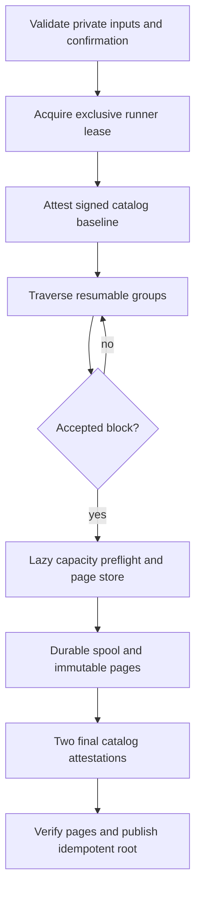

# Cross-Phase Identity Traversal Operator v1

This operator creates a signed, content-free identity publication from a signed catalog baseline. It is a local operator surface only: it does not deploy, cut over, authorize retention, delete legacy/native/RAW data, or copy the RAW store.

## Configuration and planning

The private JSON configuration has exactly these keys: `schema`, `artifactRoot`, `manifestId`, `revision`, `fabricConfigPath`, `deliveryKeyRingPath`, `leasePath`, `traversalStateRoot`, `spoolRoot`, `archiveCompletionPath`, `archiveCompletionKeyPath`, `catalogBaselinePath`, `catalogAttestationKeyPath`, `traversalCompletionKeyPath`, and `registryKeyPath`.

All paths are absolute and normalized. The referenced files are owner-only private JSON: V2 fabric configuration, delivery key ring, archive completion and signing key, signed catalog baseline and signing key, traversal completion signing key, and registry signing key. Planning verifies these documents, their signatures, key separation, archive/catalog binding, and a non-empty covered catalog.

`plan --config /absolute/private.json` is resource-free: it creates no store, lease, spool, page, or artifact. Its confirmation digest binds the configuration, indirect key-ring files, signed inputs, and selected resources. `run` requires the exact confirmation digest.

## Lifecycle



The runner owns the exclusive lease and performs three catalog attestations. State and spool names are deterministic and resumable. Capacity is checked lazily before the first accepted block: 5 GiB is the minimum and 8 GiB is recommended. An all-excluded run creates neither spool nor page store.

Pages and the root artifact are immutable, owner-only, and idempotent. Publication output is content-free:

```json
{"schema":"amf.m4-cross-phase-identity-traversal-operator-result/v1","operation":"run","runId":"m4-…","phase":"cross-phase-identity","publication":{"state":"published","artifactDigest":"sha256:…"}}
```

CLI success is one compact JSON line prefixed with `ok:true`. Failures are one compact public-safe error line and exit status 78; paths, content, keys, and messages are never emitted.

## Recovery and boundaries

Hostile paths, mutable inputs, catalog drift, unsafe modes, missing pages, or stale confirmations fail closed. Cleanup closes all constructed resources while preserving the primary failure.

An interrupted seal or publication may resume only when the traversal is complete and the persisted seal binding matches exactly. Page and root writes then retry idempotently; a different binding fails with a distinct seal-binding error before publication.

For prefix or catalog drift, preserve the old namespace and evidence. Do not edit, delete, or retry an old baseline. Create a new controlled revision with a new signed baseline and namespaces. Cleanup is a separate explicit procedure.
