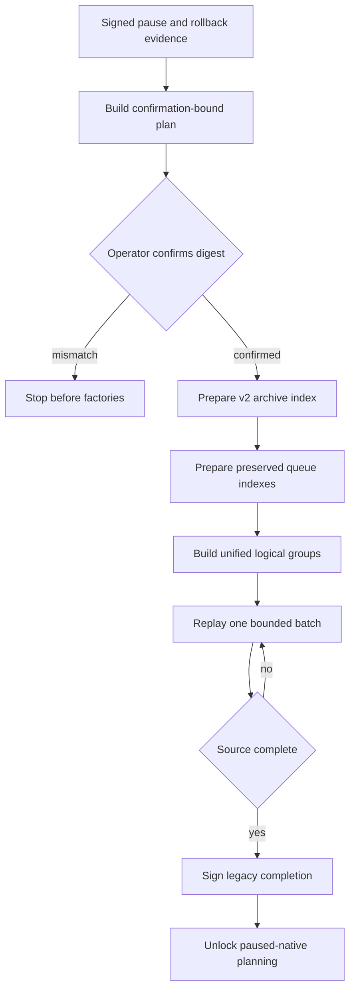

# M4 legacy grouped-replay batch runner v1

## Purpose

The legacy grouped-replay batch runner is the gated bridge between the closed
v2 and preserved-queue indexes and the paused-native phase. It prepares the
three unified indexes after operator confirmation, replays canonical logical
groups through the standard conversation projector, and emits signed completion
evidence only after the complete source has been durably checkpointed.

## Planning

Planning accepts exact signed M4 gate input for the `v2-archive` phase, one
`amf.m4-group-replay-authority/v1`, the three replay limits, a bounded maximum
batch count, and a completion manifest identifier. The derived run ID and
confirmation digest bind every serial input, the selected completion key ID,
and the verified gate evidence.
Planning does not access runtime dependency getters or invoke factories.

## Running

After exact confirmation, the runner prepares a content-free v2 index
attestation and requires the snapshot verifier to return that exact archive
chain digest, entry count, and byte count together with the signed gate's source
and target checkpoints. A substituted or empty catalog therefore cannot reuse
verification for another snapshot. The runner also binds the preserved reader's
acknowledgement, pending-outbox, and dead-letter checkpoints directly to the
signed pause manifest. Four factories create the preserved index inputs, v2
index inputs, replay resources, and completion signing key only when each is
needed. Each factory result has one value and an optional close function.
Cleanup runs in reverse order on success and failure.

The runner composes `prepareM4V2UnifiedIndex`,
`prepareM4PreservedUnifiedIndex`, `prepareM4UnifiedLogicalGroupSource`, and
`runM4PreservedGroupReplay`. A batch that cannot make progress fails closed.
An incomplete bounded run returns `completion: null` and cannot satisfy the
paused-native prerequisite.

## Completion evidence

`amf.m4-legacy-group-replay-completion/v1` contains only the replay authority
digest, one content-free final checkpoint, and signed evidence. The final
checkpoint binds the last durable group checkpoint plus the verified pause,
rollback, source, and target evidence. The completion signature is independently
verified with the configured migration signing key. The factory key ID must
match the key ID included in the operator-confirmed plan.

The component does not enumerate native transcript shards, run reconciliation,
switch reads, deploy a runtime, or delete legacy data.
