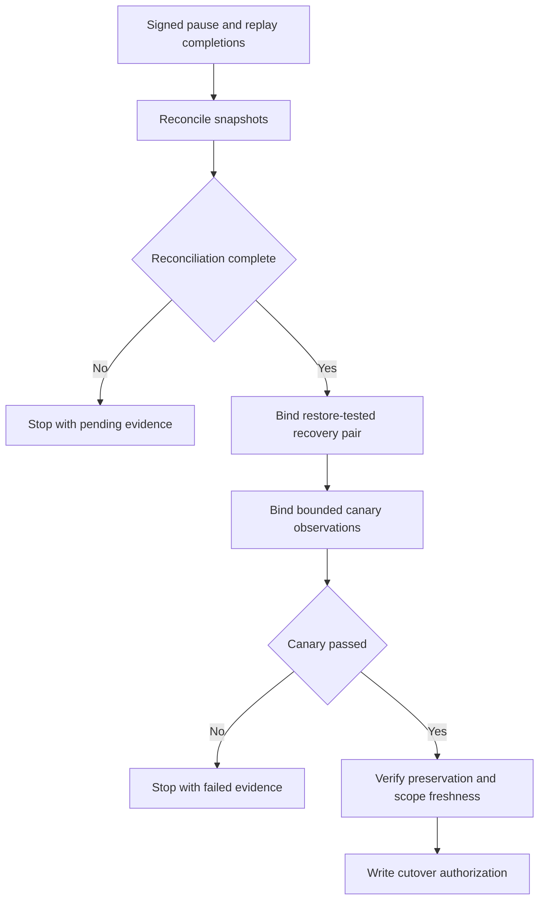

# M4 live evidence operator v1

## Purpose

The M4 live evidence operator converts independently collected, content-free
migration evidence into immutable signed artifacts. It provides one consistent
private-file boundary for reconciliation, recovery, canary, and cutover
authorization.

It does not switch a route, change configuration, run a backup or restore,
enable traffic, execute rollback, inventory cleanup targets, or delete data.
An authorization artifact is permission evidence for a separate route
executor, not a route command.



## Commands

Every stage uses a two-step confirmation flow:

```text
npm run operator:m4-live -- <stage> plan --config /absolute/private.json
npm run operator:m4-live -- <stage> run --config /absolute/private.json \
  --confirmed-plan-digest sha256:<64-lowercase-hex>
```

Supported stages are `reconciliation`, `recovery`, `canary`, and
`authorization`. Planning writes nothing. Running reloads every referenced
file, recomputes the complete binding, and rejects a changed confirmation.

Standard output contains only the operation, stage, manifest identity,
revision, state, confirmation digest, and signed payload digest. Paths, keys,
connection strings, archive content, mismatch samples, and aggregate metrics
are never printed.

## Private file contract

Configuration, signing keys, evidence, event snapshots, and attestations must
be absolute-path regular files owned by the current user with no group or
other permissions. Symlink path components are rejected. Each configuration
selects one existing owner-only artifact root; the operator derives the target
path itself:

```text
<artifact-root>/m4/<stage>/<manifest-id>-r<revision>.json
```

Artifacts are written as `0600` files using a synced temporary inode and an
atomic no-replace link. An existing target always stops the run. Parent
directories are owner-only and must remain beneath the validated artifact
root.

### Reconciliation configuration

`amf.m4-live-reconciliation-operator/v1` contains:

- artifact root, manifest ID, and revision;
- pause/rollback gate input;
- signed legacy replay and paused-native phase completions and their keys;
- source and target static-evidence maps;
- source and target content-free JSONL event snapshots;
- independently signed source and target snapshot manifests and configured trust anchors;
- independently signed, time-bounded current archive revisions and configured trust anchors;
- reconciliation key, visit bound, and mismatch-sample bound.

Each JSONL line is one strict reconciliation event containing only stable ID,
payload and logical digests, timestamps, state, and the bounded relationship
identifiers required by that state. Each `amf.m4-reconciliation-snapshot/v1`
manifest binds the archive authority, archive revision, terminal checkpoint,
exact event count, canonical event-set digest, exact file digest, static
evidence digest, capture time, exact prerequisite completion digest, and the
signed current-revision evidence. The legacy terminal checkpoint must equal the
signed replay completion checkpoint; the v3 terminal checkpoint must equal the
signed paused-native completion checkpoint. `amf.m4-reconciliation-archive-revision/v1`
provides the independently verified current archive revision in a bounded UTC
window. The legacy and v3 snapshot and revision manifests use separate
configured trust anchors, also HMAC-independent from the reconciliation and
phase completion keys.

The complete snapshot bytes are bound by the outer operator confirmation
before the existing reconciliation runner opens either iterator. While the
iterator is consumed, the operator recomputes the canonical ordered event-set
digest and count from the bytes actually read and rechecks the anchored file
identity at end-of-file. Both trusted manifests must verify completely before a
reconciliation manifest is written. The output is therefore truthfully
`complete` or `pending`; two matching subsets without valid completeness
attestations cannot produce cutover evidence. Pending evidence cannot enter
recovery or authorization.

### Recovery configuration

`amf.m4-live-recovery-operator/v1` references a complete reconciliation
manifest and key, independent restore-tested records for the legacy and v3
archives, and a recovery signing key. The operator verifies the pair and writes
`amf.m4-recovery-pair/v1`. It does not create either recovery copy or perform a
restore.

### Canary configuration

`amf.m4-live-canary-operator/v1` references a bounded policy, aggregate
observations, a separate rollback-drill attestation, and a canary signing key.
The derived output is truthfully `passed` or `failed`. A failed artifact is
retained for audit but cannot authorize cutover.

### Authorization configuration

`amf.m4-live-authorization-operator/v1` references the complete reconciliation,
recovery, alias, canary, preservation, and selector-scope evidence chain, plus
the exact public-reader and extractor-reader revisions, rollback revision, and
authorization key. `authorizedAt` is explicit and plan-bound.

Planning and running both compare the process's trusted current UTC time with
the signed selector-scope validity window. Running repeats this check
immediately before the immutable authorization write. An expired scope, failed
canary, incomplete reconciliation, open plaintext selector, alias drift,
rollback mismatch, or reused authority key stops authorization.

## Operational boundary

The operator assumes that separate read-only collectors produced the
content-free reconciliation snapshots, canary aggregate, rollback drill, and
recovery records. Their collection procedures must independently prove source
completeness and backup/restore success. Supplying a statement that an action
passed is not a substitute for that evidence.

A later route executor must reverify the authorization, trusted current time,
configured route revisions, and rollback checkpoint immediately before making
any change. Cleanup remains a separate, explicitly approved operation over an
exact signed inventory.
