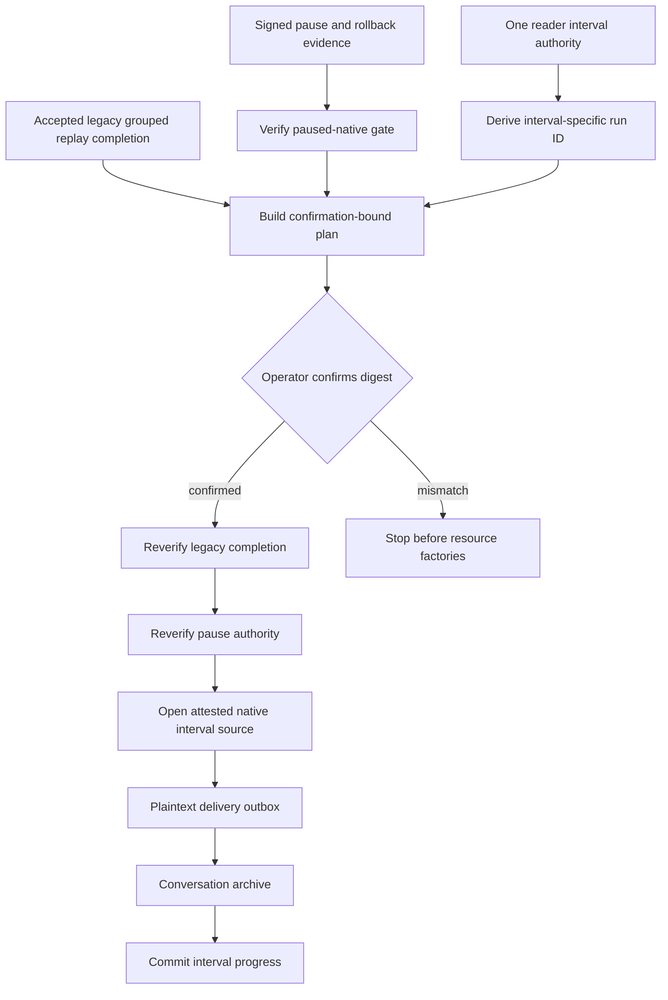

# M4 native paused batch runner v1

## Purpose

The M4 native paused batch runner executes one bounded paused-native interval through the standard M4 backfill coordinator. It connects an attested native reader to the conversation archive without giving the reader access to the archive, outbox, progress store, or migration keys.

Each interval is an independent approved run. This keeps progress and resume state isolated when a large native source is split into coordinator-sized shards.

## Flow



## Planning contract

`planM4NativePausedBatch` accepts exactly:

```text
gateInput
maxEvents
authority
legacyCompletion
```

The gate must be approved for `paused-native`. Its signed pause evidence, native transcript authority, and source checkpoint must match the interval authority directly. Caller-supplied verification cannot substitute a different native authority.

`legacyCompletion` is an accepted `amf.m4-legacy-group-replay-completion/v1` document. It declares a complete legacy grouped replay and carries its authority digest, final checkpoint, and signed evidence reference. The run ID must equal `deriveM4NativePausedRunId(authority, legacyCompletion)`.

The returned confirmation digest binds the normal M4 batch plan, the complete serializable interval authority, and the legacy completion document. Changing either authority, the source binding, interval boundary, chain, initial checkpoint, or prerequisite completion changes both the required run ID and the confirmation digest.

Planning creates no lease, reader, outbox, archive, or progress resource.

## Run contract

`runM4NativePausedBatch` additionally receives:

```text
confirmedPlanDigest
reader
derivationKey
derivationKeyId
verifyPauseEvidence
verifyLegacyCompletion
integrityFor
factories
```

The four factories create the lease, plaintext delivery outbox, archive adapter, and progress store. The runner creates the paused-native source itself so a factory cannot replace the confirmed interval with another source.

Before any resource factory runs, the runner:

1. rebuilds the plan;
2. verifies the confirmation digest;
3. reads and validates runtime dependencies;
4. verifies that the accepted legacy completion evidence is still current;
5. verifies current pause evidence, native transcript authority, and source checkpoint.

Runtime dependency getters are not read before confirmation succeeds. Getter failures are normalized and do not expose their underlying messages.

The underlying source repeats pause verification when it opens the reader. The coordinator then applies its normal order: acquire lease, read one bounded source batch, enqueue, deliver, commit acknowledged progress, and release resources. Source cleanup destroys its private derivation-key copy on success and failure.

## Shards and resume

A reader catalogue may split one logical source into multiple intervals. Each interval must use its own derived run ID and therefore its own progress namespace. A later interval never consumes the prior interval's checkpoint.

Within one interval, retries resume from the last acknowledged opaque native checkpoint. Re-running a completed interval produces no additional archive row and completes from its existing progress.

The runner refuses to begin an interval without accepted and currently verified legacy grouped replay completion. It does not decide cross-interval order or declare the full paused-native phase complete. A later orchestration layer must:

- preserve catalogue order;
- require every expected interval exactly once;
- record per-interval completion evidence;
- refuse reconciliation or cutover while any interval is incomplete.

## Boundaries

This component does not read files, discover native sources, build pause capsules, replay legacy outboxes, reconcile archives, switch reads, delete legacy data, or deploy a runtime. Those are separate gated steps.
