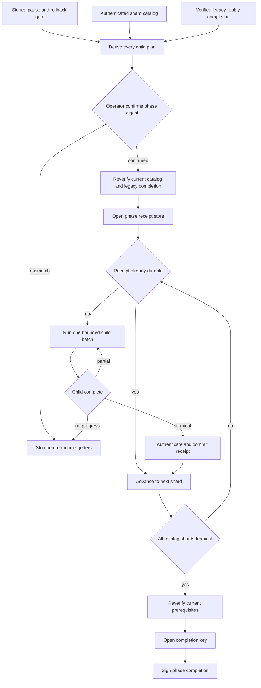

# M4 native paused phase orchestrator v1

## Purpose

The phase orchestrator turns an authenticated native shard catalog into one
durable paused-native phase completion. It derives every child plan through the
standard M4 batch runner, executes shards in catalog order, and refuses to sign
completion until every expected shard has one authenticated terminal receipt.



## Authenticated catalog

`createM4NativePausedShardCatalog` creates the exact content-free
`amf.m4-native-paused-shard-catalog/v1` document. Its common pause evidence,
native transcript authority, and initial checkpoint must match every shard
authority. Shards have sequential zero-based ordinals, bounded batch sizes, and
unique interval authorities. Repeated source bindings must remain in one
contiguous catalog segment, and their intervals must be gap-free and
non-overlapping.

The complete payload is authenticated with a domain-separated HMAC and key ID.
`verifyM4NativePausedShardCatalog` independently validates the exact shape,
payload digest, key binding, and constant-time signature comparison. Runtime
also asks an independent catalog provider for the current signed catalog before
opening resources and again before requesting the completion key. A stale,
subset, reordered, or otherwise substituted catalog therefore cannot reuse a
confirmed plan.

## Planning

`planM4NativePausedPhase` accepts exactly:

```text
gateInput
catalog
catalogKey
legacyCompletion
maxCallsPerInvocationPerShard
maxCallsPerInvocationTotal
receiptKeyId
completionManifestId
completionKeyId
```

The planner derives each interval run ID and calls `planM4NativePausedBatch`
itself. Caller-supplied child plans are not accepted. The returned phase plan
binds the verified pause and rollback evidence, catalog digest, legacy
completion digest, ordered child confirmations, all call bounds, and completion
identifiers. The catalog binding covers the complete signed document, including
its key ID and signature, rather than only its payload digest. Planning creates
no phase lease, phase store, reader, archive, outbox, progress store, receipt
key, or completion key.

## Running and restart safety

`runM4NativePausedPhase` additionally requires the exact confirmed plan digest,
current-catalog and current-legacy verifiers, plus five factories:

```text
receiptKey
phaseLease
phaseStore
shard
completionKey
```

Runtime getters and factories are not read before confirmation succeeds. The
receipt key is distinct from the catalog signing key and its key ID is bound by
operator confirmation. Equal key IDs are rejected while planning, and
HMAC-equivalent decoded keys under different IDs are rejected with a
constant-time comparison of normalized SHA-256 key blocks before the lease or
phase store is opened. A catalog signer therefore cannot forge terminal execution
receipts. The phase lease is acquired before the store is opened,
heartbeated during execution, and released during reverse cleanup; a concurrent
writer must fail before it can observe or mutate phase state.

The orchestrator loads and authenticates the durable receipt prefix, skips
already terminal shards, and runs the first missing child until it completes or
reaches the confirmed per-invocation per-shard or total call bound. These names
are deliberately invocation-local: a restart gets a new bounded execution
attempt while durable child progress and terminal receipts still prevent
duplicate delivery. A partial child that reports zero progress fails closed. A
later shard cannot start until the prior terminal receipt has been written,
acknowledged, reloaded, and verified.

If a process stops before receipt commit, the child progress store makes the
retry idempotent. If it stops after receipt commit, the next run verifies the
receipt and skips that child. Each receipt binds its ordinal, child run and plan,
authority, legacy prerequisite, terminal checkpoint, and complete child result
under the dedicated receipt integrity key.

Resources close in reverse order. Cleanup failures never replace an existing
primary failure, and all loaded signing-key buffers are zeroized.

## Completion

`amf.m4-native-paused-phase-completion/v1` is content-free. It binds the phase
run ID, verified gate evidence, complete signed catalog, legacy completion,
receipt key ID, ordered receipt digest, and deterministic final checkpoint. The
completion key ID is included
in the confirmed plan and the signed evidence. The completion-key factory is
not accessed while any receipt is missing, while a bound is exhausted, or when
the final prerequisite recheck fails.

`verifyM4NativePausedPhaseCompletion` independently verifies the exact payload,
recomputes the final checkpoint and evidence digest, checks the key ID, and
compares the signature in constant time.

## Boundary

This component does not discover native files, create pause capsules, switch
reads, reconcile archives, deploy a runtime, or delete legacy data. A later
reconciliation runner must verify the exact accepted phase completion before it
reads either reconciliation source and must bind that prerequisite into its
signed reconciliation evidence.
