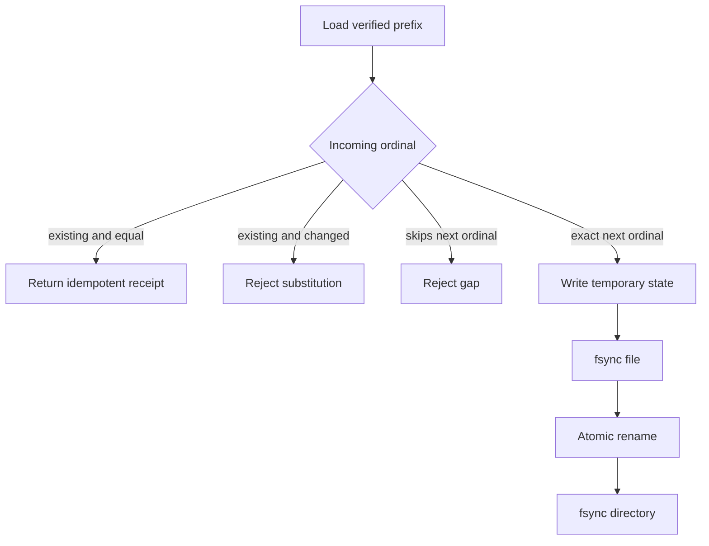

# M4 native paused phase store v1

## Purpose

`M4NativePausedPhaseStore` durably records the ordered terminal receipt prefix
for one confirmed paused-native phase. Its namespace binds the phase run ID,
phase confirmation digest, and authenticated catalog digest. The filename is a
compact digest of that binding; the complete binding is also stored and
verified inside the state document.

Each `amf.m4-native-paused-phase-receipt/v1` contains only:

```text
ordinal
child run ID and confirmation digest
child authority and legacy-completion digests
terminal opaque checkpoint
complete child-result digest
domain-separated integrity evidence
```

No source record, conversation payload, path, command, or credential is stored.
The orchestrator verifies receipt integrity and exact child-plan membership
before it trusts a loaded prefix.

## State transitions

The store accepts only the next catalog ordinal. Repeating an identical durable
receipt is idempotent. A gap, changed prior receipt, foreign binding, invalid
shape, closed-store access, or corrupt state fails with a fixed content-free
error.



## Filesystem safety

The root must be an owner-controlled `0700` directory with no symlink in any
existing path component. State files must be owner-controlled regular `0600`
files. Reads pin a no-follow file descriptor and reject inode, size, timestamp,
permission, or ownership changes during the read. Writes use exclusive
no-follow temporary files, file fsync, atomic rename, and directory fsync.
Recognized torn temporary files are removed on restart. The serialized state is
bounded to 2 MiB for at most 1,000 content-free receipts.

The store does not sign receipts, run child migration batches, or authorize
phase completion. Those responsibilities remain in the phase orchestrator.
