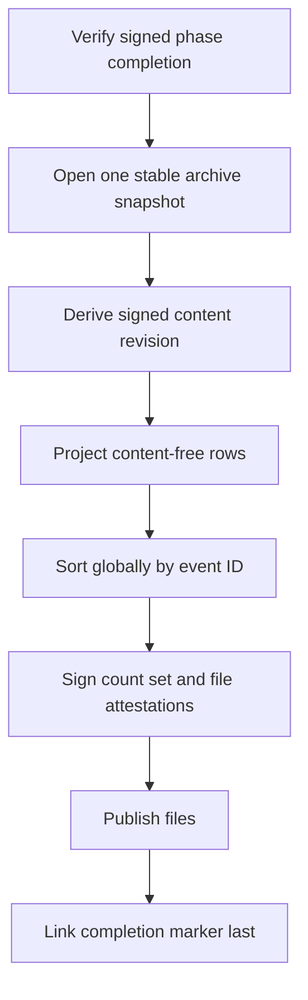

# M4 reconciliation collector v1

## Purpose

The collector creates independently signed, content-free archive snapshots for
the M4 reconciliation operator. It reads legacy or v3 conversation storage but
publishes only stable identifiers, digests, timestamps, states, and bounded
relationship identifiers.

It does not backfill data, assert that a migration phase completed, create a
backup, run a restore, switch a route, collect canary metrics, or delete legacy
storage.



## Source contract

A source exposes `revisionSource()`, one ascending `events` async iterable, and
`close()`. The revision scan and event scan must observe the same immutable
database or materialized snapshot. A source cannot be reused.

The built-in v3 adapters enumerate every archive state, including expired,
replaced, tombstone, and conflict rows. SQLite uses one read transaction.
PostgreSQL uses one `REPEATABLE READ READ ONLY` transaction. Both use bounded
keyset pages ordered by `event_id` and select only the JSON relationship fields
needed for reconciliation. They never select or return the full event JSON.

The legacy source composes the canonical v2 archive index with the preserved
outbox and dead-letter indexes before projection. It immediately removes
visible content from each projected event. A bounded external sort uses
owner-only anonymous temporary inodes (`O_TMPFILE`) and fixed fan-in merge
passes. No replaceable child pathname exists during sorting or cleanup, and the
collector fails closed when the selected Linux filesystem cannot provide
anonymous temporary inodes. Neither plaintext nor an unbounded event list is
retained in memory or written to named files.

The legacy source requires both `maxEvents` and `chunkMaxEvents`. Their ratio
must fit the fixed anonymous-descriptor budget before source construction, and
the projected event count is checked again while scanning. This bounds memory,
temporary storage, and simultaneously open descriptors independently of input
size.

Archive-specific resource construction is intentionally dependency-injected.
The public package defines and verifies the source contract; a deployment
adapter supplies its catalog, raw-store, preserved-queue reader, decoder, and
key material. This avoids treating caller-provided JSON as proof of archive
completeness.

## Collection operator

`planM4ReconciliationCollection()` accepts one owner-only configuration file.
The exact `amf.m4-reconciliation-collector-operator/v1` shape contains:

- artifact root, bundle ID, archive kind, snapshot ID, revision-manifest ID,
  and operator revision;
- signed phase-completion, completion-key, revision-key, snapshot-key, and
  static-evidence file paths;
- an owner-only source-configuration file whose exact digest is plan-bound and
  whose schema is validated by the deployment adapter;
- revision validity in seconds and the maximum event count.

Planning verifies the phase completion and effective HMAC key separation,
binds every referenced file, confirms that the target is absent, and does not
open a source or create a directory. Running reloads the inputs, requires the
exact confirmation digest, opens the supplied source, derives its content
revision, and publishes one immutable bundle. Output is limited to public-safe
operation metadata and signed digests; it contains no paths, connection
strings, keys, event rows, or mismatch samples.

Legacy completion, revision, and snapshot roles use distinct effective HMAC
keys. The same applies to the native-phase completion and v3 snapshot roles.
Completion is verified before a source is opened and key separation is checked
before any legacy decryption can occur.

## Bundle contract

The derived layout is:

```text
<artifact-root>/m4/snapshots/<bundle-id>/
  events.jsonl
  revision.json
  snapshot.json
  complete.json
```

Directories are `0700` and files are `0600`. Symlink components and existing
targets are rejected. Files are synced and linked without replacement;
`complete.json` is linked last. The live reconciliation operator verifies the
marker, canonical layout, file digests, count, event-set digest, and signed
manifests before it opens either event iterator.

## Validation

Run the focused suite with:

```text
npm run test:m4-reconciliation-collector
```

The fixtures cover every relationship state, SQLite and PostgreSQL transaction
lifecycle, early rollback, multi-pass legacy sorting, duplicate IDs, bounded
publication, key separation, input drift, private permissions, and partial
bundle rejection. Fixtures contain synthetic identifiers and no private
conversation content.
