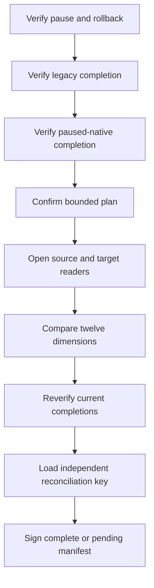

# M4 reconciliation runner v1

This runner turns the existing twelve-dimension, content-free reconciliation
reader into plan-gated migration evidence. It verifies the signed aggregate
pause and restore-tested rollback, the signed legacy replay completion, and the
signed paused-native phase completion before it opens either archive reader.
The native completion must bind the exact legacy completion and gate evidence.

The confirmed plan binds both completion documents, both exact static-evidence
maps, the visit and mismatch-sample bounds, manifest identity, revision, and
reconciliation signing authority. A changed current completion fails before
readers are opened and is checked again before the signing key is requested.
The source and target factories must return the exact static evidence confirmed
by the operator; substitution fails before either event iterable is consumed.

The reconciliation key must have a distinct ID and distinct effective
HMAC-SHA256 key material from both completion authorities. Effective keys are
compared in constant time after normalization to 64-byte HMAC blocks, including
the zero-padding equivalence class. Temporary decoded keys and normalized blocks
are wiped.

A zero-mismatch report produces a signed `complete` reconciliation manifest. A
truthful nonzero report produces a signed `pending` manifest and can never be
represented as complete. Resources close in reverse order and cleanup failures
never replace the primary comparison or verification failure.

This module does not write either archive, change routes, authorize cutover,
copy recovery data, observe a canary, or delete legacy data.
