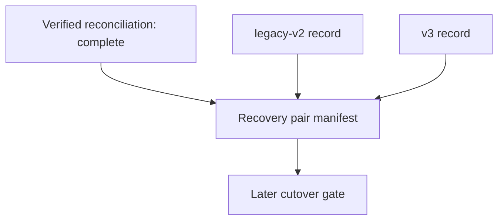

# M4 Recovery Pair Manifest v1

`amf.m4-recovery-pair/v1` is a content-free, signed evidence contract for a later M4 cutover decision. It is deliberately separate from the standard migration manifest and does not add a new migration phase. It accepts a verified, complete reconciliation manifest and two independently restore-tested records in this fixed order:

Each record carries only checkpoint identifiers and SHA-256 digests for a recovery copy, catalog snapshot, isolated restore target, restored checkpoint, and verification. `restoreTest` must be `passed`. Archive labels and all checkpoint identity/digest bindings are strict; a copy, restore target, or verification cannot be reused for both archives.

The manifest uses canonical JSON and HMAC-SHA256. Its signed payload binds its identity and revision, the complete reconciliation manifest identity/integrity evidence, and both recovery records. Verification is constant-time and signing keys must be canonical base64-encoded 32–64 byte values.

## Boundary

This is evidence only. It does not implement backups, copy archive or deployment data directories, deploy anything, cut over, delete data, or authorize those actions.
