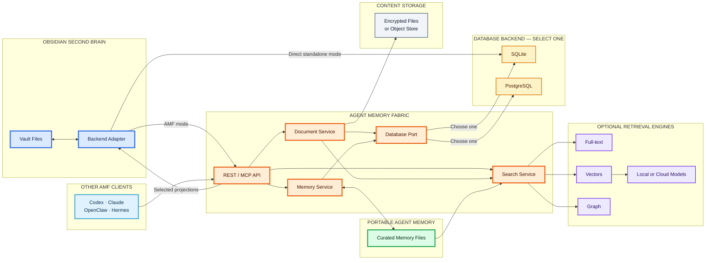
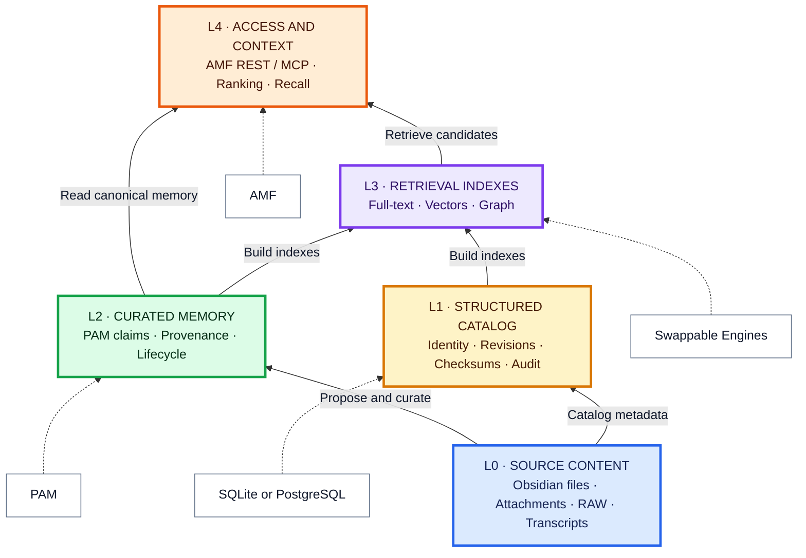

# Obsidian Second Brain integration

The normative document identity, lifecycle, API and deployment rules are in
[Document corpus contract v1](document-contract-v1.md). Security controls and
test gates are in the [Obsidian bridge threat model](obsidian-threat-model.md).

Status: planned architecture; not implemented or enabled by default.

[Obsidian Second Brain](https://github.com/NestDevLab/obsidian-second-brain) is an
optional Agent Memory Fabric (AMF) client. It remains usable as a standalone
human workspace while gaining document ingestion, contextual search, memory
proposals, and selected PAM projections when connected to AMF.

## Component boundaries

The product boundaries are intentional:

- **Obsidian Second Brain** owns the vault, editorial experience, and client
  adapter. It can use SQLite directly or connect to AMF like any other client.
- **AMF** owns the API, document corpus, memory orchestration, contextual search,
  health, and swappable backend contracts.
- **PAM** is the current canonical-memory implementation. It owns curated memory
  records, not Obsidian documents or RAW transcripts.
- **SQLite/PostgreSQL** implement the data-store contract. They catalog content
  and structured state; they do not become part of Markdown or RAW files.
- **Full-text, vector, and graph engines** are derived, rebuildable retrieval
  layers rather than canonical memory.

## Backend selection

Each steady-state deployment selects one active data path:

| Profile | Data path | Intended use |
|---|---|---|
| Simple | Obsidian → SQLite | Standalone and single-user |
| Local AMF | Obsidian → AMF → SQLite | Full local AMF behavior |
| Shared AMF | Obsidian → AMF → PostgreSQL | Shared and multi-agent |

The SQLite adapter may be reused by the direct provider and AMF, but independent
writers must never own the same database file concurrently. A durable outbox is
a delivery queue, not a second memory database. `shadow` is the only temporary
dual-path mode: the direct provider remains authoritative while AMF produces
diagnostic comparison evidence.

An AMF deployment does not require a second Obsidian-specific SQLite index. If
AMF is unavailable, the client can still use vault files, native search, existing
projections, and its outbox. An additional offline vector cache can be offered as
an explicit optional capability.

## Memory and knowledge layers

The layers separate authority from retrieval complexity:

1. L0 keeps source content in its native form.
2. L1 catalogs identity, revisions, checksums, cursors, and audit state.
3. L2 contains curated, lifecycle-aware canonical memory in PAM.
4. L3 provides replaceable full-text, vector, and graph indexes.
5. L4 exposes contextual retrieval to every client through AMF.

A database may physically host both catalog tables and derived indexes, but the
logical roles remain separate. Vector search is more sophisticated retrieval,
not more authoritative memory.

## Integration modes

- `standalone`: direct SQLite provider; no AMF service dependency.
- `shadow`: standalone behavior remains visible while AMF ingest and queries are
  compared diagnostically.
- `active`: AMF document ingestion, contextual search, memory proposals, and
  selected PAM projections are enabled.

Obsidian content remains editorial source material. Indexing a document does not
make every sentence canonical memory. Promotion still goes through an explicit
proposal and the normal AMF curation lifecycle.

## 0.6 rollout gate

1. Back up the catalog and encrypted RAW store, then build the reviewed merge
   commit as `agent-memory-fabric:0.6.0`.
2. Select exactly one document backend. Shared deployments set
   `AMF_DOCUMENT_BACKEND=postgresql` and reuse the least-privilege catalog URL;
   local deployments use a distinct SQLite path.
3. Start with Mem0 disabled and a synthetic vault in `shadow`. Require healthy
   document-store status, idempotent retry, tombstone replay, bounded snippets,
   cross-vault denial, and zero plaintext in logs.
4. Enable a real vault only after the client outbox is empty and the selected
   vault ID is present in the actor ACL. Vault paths and tokens remain external
   configuration, never repository defaults.
5. Roll back by stopping document delivery and restoring the prior image. Keep
   the client outbox and additive document tables for reconciliation; do not
   delete or rewrite source notes.
